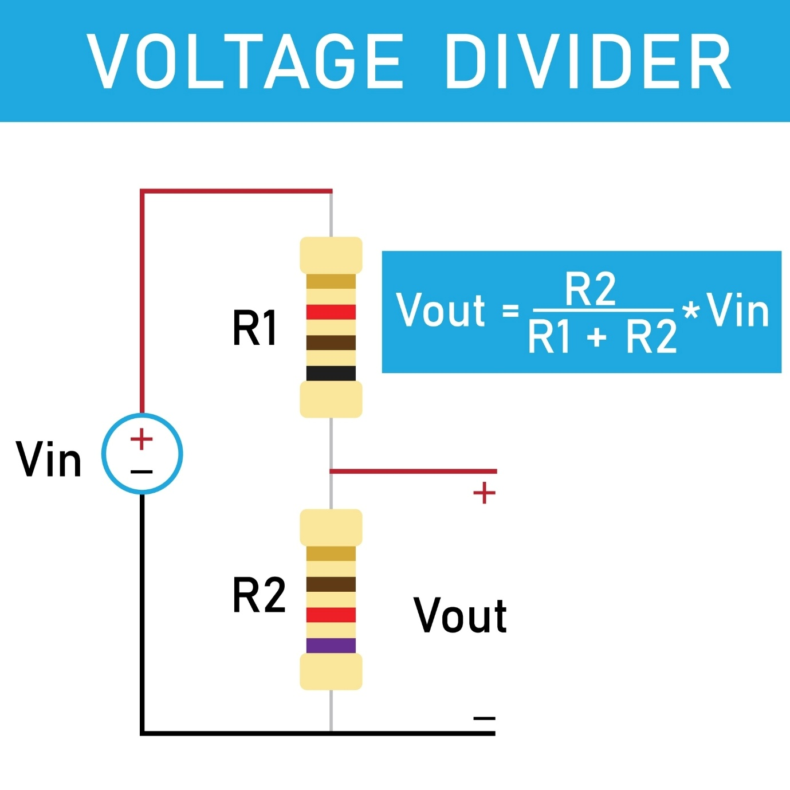
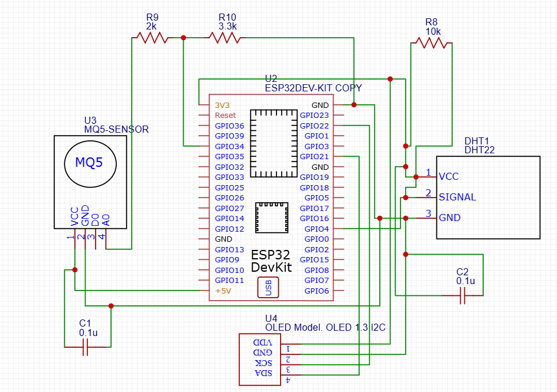
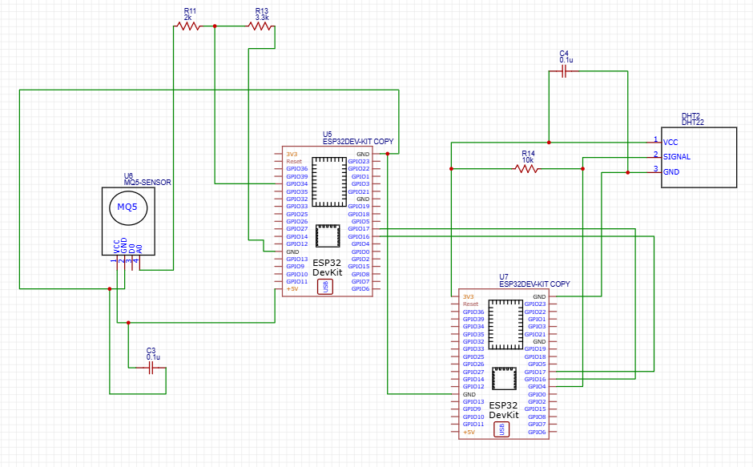
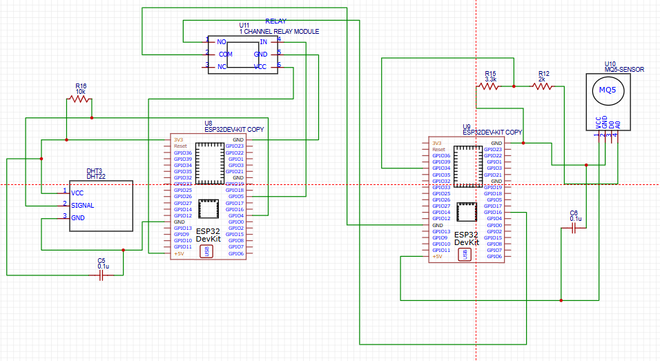
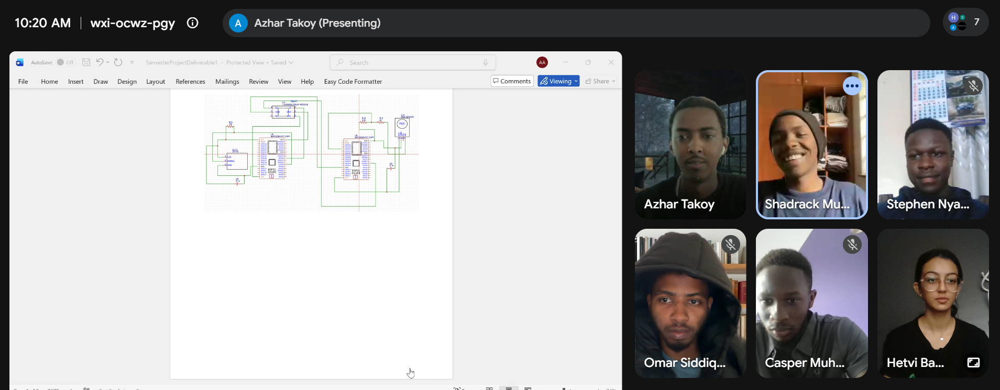

## Sunflower Growth Requirements

| **Growth Characteristic** | **Optimal Range / Recommendation** |
| --- | --- |
| **Temperature** | 21°C - 30°C (70°F - 86°F) |
| **Relative Humidity** | Low to moderate (good airflow is critical to prevent fungal diseases) |
| **Soil Type** | Well-drained, moderately fertile loam |
| **Soil Moisture Content** | 1 to 1.5 inches of water per week (allow the top 2 inches of soil to dry out between deep waterings) |
| **Soil pH** | 6.0 - 7.5 (Slightly acidic to slightly alkaline) |
| **Sunlight Exposure** | Full sunlight (at least 6 to 8 hours of direct, unobstructed sun per day) |

**Reference:** [Holmes Seed Company – Sunflower Growing Guide](https://www.holmesseed.com/growers-guidebook/growing-guides/sunflower-growing-guide/)

---

## Hardware Bill of Materials

### 1. Core Processing & Display (Mandatory)

- **ESP32S DevKIT WIFI + BLE Module (30Pin):** The main controller; it reads the sensors and provides Wi-Fi/BLE connectivity.
- **1.3" White IIC 128X64 OLED LCD:** A simple screen used to display the sensor readings locally.
- **5V 1-Channel Low Level Trigger Relay Module:** An electronic switch for driving an external device, such as a water pump or fan, based on sensor readings.

### 2. Assignment-Mandated Sensors

- **DHT22 AM2302 Temperature and Humidity Sensor:** A digital sensor for ambient air temperature and relative humidity.
- **MQ-5 Gas Sensor:** An analog sensor for detecting the concentration of LPG (methane/butane/propane) in the air.

### 3. Additional Sensors for Sunflower Metrics

- **Capacitive Soil Moisture Sensor (v1.2 or similar):** Measures soil moisture by capacitance. Unlike cheaper resistive probes that corrode quickly, it resists corrosion and lasts far longer in damp soil, making it well suited to continuous plant monitoring.
- **Analog Soil pH Sensor/Meter Module:** An analog probe inserted into the soil to read its acidity or alkalinity. Standard "gravity" or plug-and-play analog modules are suitable.
- **LDR (Light Dependent Resistor) Module:** A low-cost photoresistor module that detects light intensity, used to track daily sunlight exposure.

### 4. Prototyping Tools & Accessories

- **Solderless Breadboard:** A board that allows the ESP32 and sensors to be plugged in and connected temporarily. A full-size (830 tie-point) board is preferred, since the ESP32 is physically wide.
- **Jumper Wires:** A variety are needed to connect pins, in three configurations:
  - *Male-to-Male* (for connecting the breadboard to itself)
  - *Male-to-Female* (for connecting sensors directly to the ESP32 or breadboard)
  - *Female-to-Female* (for connecting certain modules directly to each other)
- **Micro-USB or USB-C Cable:** Required to connect the ESP32S to a computer for programming and power. A data-capable cable is required, not a charge-only one.
- **Basic Resistor Kit (e.g., 10kΩ, 330Ω):** Used as voltage dividers and pull-ups; required where a bare component rather than a pre-built module is used (particularly for the LDR if it is not on a module board).

---

## Hardware Datasheets

| Component | Datasheet |
| --- | --- |
| **1.3" White IIC 128X64 OLED LCD** | [Waveshare 1.3-inch OLED Display Datasheet (PDF)](http://5.imimg.com/data5/SELLER/Doc/2025/8/540835979/XC/UK/QG/1833510/waveshare-1-3-inch-oled-a-sku-10444.pdf) |
| **ESP32S DevKIT WIFI + BLE Module (30Pin)** | [Espressif ESP32-WROOM-32 Module Datasheet (PDF)](https://www.mouser.com/datasheet/2/891/esp-wroom-32_datasheet_en-1223836.pdf) |
| **DHT22 AM2302 Temperature and Humidity Sensor** | [Aosong DHT22 / AM2302 Technical Datasheet (PDF)](https://cdn.sparkfun.com/assets/f/7/d/9/c/DHT22.pdf) |
| **MQ-5 LPG, Natural Gas, Coal Gas Sensor** | [Hanwei Electronics MQ-5 Gas Sensor Technical Data (PDF)](https://files.seeedstudio.com/wiki/Grove-Gas_Sensor-MQ5/res/MQ-5.pdf) |
| **5V 1-Channel Low Level Trigger Relay Module** | [Handson Technology 1-Channel 5V Relay Module Guide (PDF)](https://handsontec.com/dataspecs/relay/1Ch-relay.pdf) *(Note: Standard relay breakout boards do not have traditional microchip datasheets; a comprehensive manufacturer's engineering guide containing the schematic and pinout serves as the correct documentation here.)* |

---

## Circuit Architectures

### Background: Voltage Divider

The MQ-5 gas sensor outputs a 0–5V analog signal, but the ESP32 ADC pins tolerate only up to 3.3V, so a direct connection would damage the pin. A voltage divider scales this signal safely down to ~3.1V.

---

### Architecture A — Single ESP32 (All-in-One)

**Design:** 1 ESP32S connected to 1 MQ-5 gas sensor, 1 DHT22 temperature/humidity sensor, and 1 OLED LCD.

#### Component Placement
- **ESP32 30-pin** at the centre
- **DHT22 Sensor** placed to the left of the ESP32
- **MQ-5 Sensor** (VCC, GND, D0, A0) placed to the right
- **1.3" OLED** (4-pin I2C version) placed below the ESP32
- **Passives:** three resistors and two capacitors (ceramic, 100nF / 0.1uF)

#### Power & Ground
- **Ground:** ESP32 GND → DHT22 GND, MQ-5 GND, OLED GND (all share common ground)
- **3.3V Power:** ESP32 3V3 → DHT22 VCC, OLED VCC
- **5V Power:** ESP32 VIN → MQ-5 VCC (requires 5V to heat its internal element correctly)

#### OLED Display (I2C)
- OLED SDA → **GPIO 21**
- OLED SCL (SCK) → **GPIO 22**

#### DHT22 Temperature & Humidity Sensor
- DHT22 DATA → **GPIO 4**
- **10kΩ pull-up resistor** between DATA line and VCC (3.3V)
- **100nF capacitor** across VCC and GND of DHT22

#### MQ-5 Gas Sensor (Voltage Divider)
- MQ-5 A0 → **2kΩ** resistor → **3.3kΩ** resistor → GND
- Middle junction → **GPIO 34** (ADC1_CH6), scaling 5V down to ~3.1V
- **100nF capacitor** across MQ-5 VCC and GND

#### Verification
- All grounds share a common connection ✓
- MQ-5 receives 5V; DHT22 and OLED receive 3.3V ✓
- Voltage divider and pull-up resistor labelled on schematic ✓

---

### Architecture B — Two ESP32s via UART

**Design:** 1 ESP32S (+ MQ-5) interfaced directly with another ESP32S (+ DHT22) over UART serial communication, with TX and RX lines crossed over.

#### Component Placement
- **Two** ESP32 30-pin DevKit modules: Node 1 (left), Node 2 (right)
- **MQ-5** sensor near Node 1
- **DHT22** sensor near Node 2
- **Three resistors:** 10kΩ, 2kΩ, 3.3kΩ
- **Two** 100nF ceramic capacitors

#### Node 1 (ESP32 + MQ-5)
- ESP32 GND → MQ-5 GND
- ESP32 VIN (+5V) → MQ-5 VCC
- Voltage divider: MQ-5 A0 → 2kΩ → 3.3kΩ → GND; middle junction → **GPIO 34**
- 0.1uF capacitor across MQ-5 VCC and GND

#### Node 2 (ESP32 + DHT22)
- ESP32 GND → DHT22 GND
- ESP32 3V3 → DHT22 VCC
- DHT22 SIGNAL → **GPIO 4**
- **10kΩ pull-up resistor** between SIGNAL and 3V3
- 0.1uF capacitor across DHT22 VCC and GND

#### UART Link
- Node 1 **GPIO 17 (TX2)** → Node 2 **GPIO 16 (RX2)**
- Node 1 **GPIO 16 (RX2)** → Node 2 **GPIO 17 (TX2)**
- GND on Node 1 → GND on Node 2 (shared common ground required)

---

### Architecture C — Two ESP32s via Relay

**Design:** 1 ESP32S (+ DHT22 + Relay) connected to another ESP32S (+ MQ-5), where the relay acts as a physical bridge between the two nodes.

#### Component Placement
- **Two** ESP32 30-pin DevKit modules: Node 1 (left), Node 2 (right)
- **DHT22** sensor near Node 1
- **MQ-5** sensor near Node 2
- **5V 1-channel relay module** (VCC, GND, IN; NO, NC, COM terminals)
- **Three resistors:** 10kΩ, 2kΩ, 3.3kΩ
- **Two** 100nF ceramic capacitors

#### Node 1 (ESP32 + DHT22 + Relay)

**DHT22:**
- ESP32 GND → DHT22 GND
- ESP32 3V3 → DHT22 VCC
- DHT22 SIGNAL → **GPIO 4**
- **10kΩ pull-up resistor** between SIGNAL and 3V3
- 0.1uF capacitor across DHT22 VCC and GND

**Relay Module:**
- Relay GND → ESP32 (Node 1) GND
- Relay VCC → ESP32 (Node 1) VIN (+5V)
- Relay IN (SIGNAL) → **GPIO 5**

#### Node 2 (ESP32 + MQ-5)
- ESP32 GND → MQ-5 GND
- ESP32 VIN (+5V) → MQ-5 VCC
- Voltage divider: MQ-5 A0 → 2kΩ → 3.3kΩ → GND; middle junction → **GPIO 34**
- 0.1uF capacitor across MQ-5 VCC and GND

#### Relay Interface
- Relay **COM** terminal → GND on Node 2
- Relay **NO** (Normally Open) terminal → **GPIO 16** on Node 2

> **Firmware note:** GPIO 16 is configured as INPUT_PULLUP. When Node 1 energises the relay, the switch closes and pulls GPIO 16 to LOW, signalling Node 2 that the relay has been activated.

---

## Evidence of Groupwork

---
