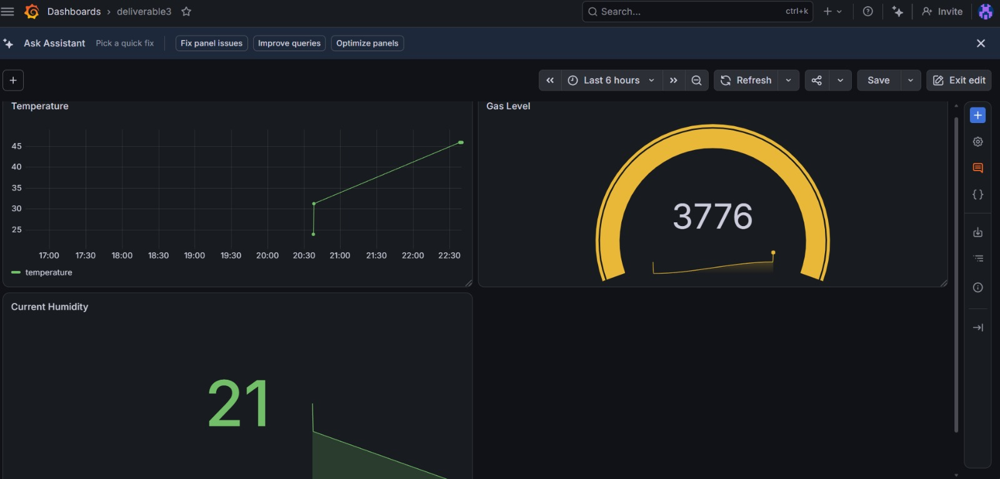
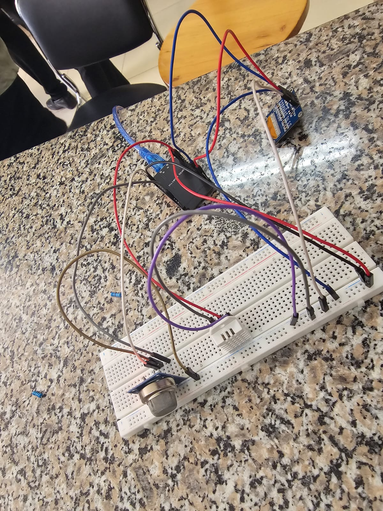
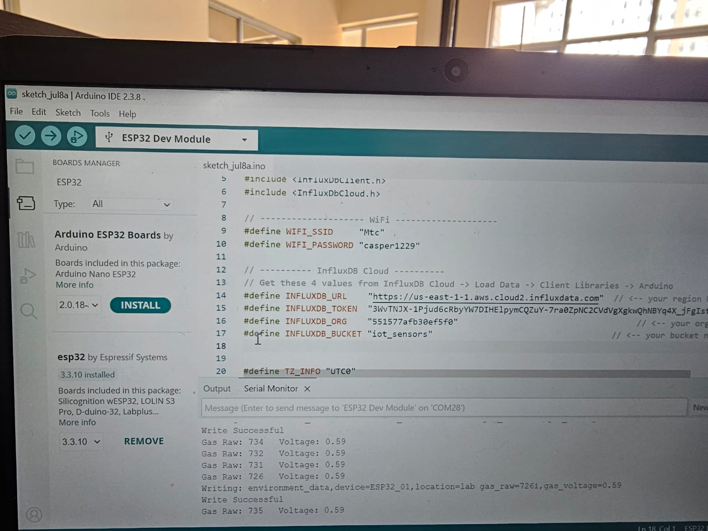

# ICS 4111: Embedded Systems & IoT
## Semester Project Deliverable 3: Cloud Integration
*Group 5 Lazy Lobsters*

## 1. Objective
For this part of the project, we needed to take our sensor data and push it to the cloud for storage and visualisation. We used the physical prototype of Architecture A to get the full score on the hardware side.

## 2. Hardware Setup
We reused the physical breadboard setup from Deliverable 2. This consists of:
* 1x ESP32S development board
* 1x MQ-5 gas sensor
* 1x DHT22 temperature and humidity sensor
* 1x 1.3" OLED display

The ESP32 reads the local environment data. Instead of just printing it to the OLED, it now connects to the local Wi-Fi network and streams the data upwards.

## 3. Cloud Communication Logic
We chose InfluxDB for our time-series database and Grafana for our dashboard. These two work really well together for IoT data.

In our Arduino code, we added the Wi-Fi library to connect the ESP32 to the local router. Once connected, we use HTTP POST requests to send the sensor readings directly to our InfluxDB cloud instance using their API. We set the transmission interval to push new data every 10 seconds.

## 4. Data Storage and Visualisation
With the data successfully landing in InfluxDB, we linked Grafana to the database to create our monitoring dashboard. We set up three main visualisations to help Sheila and her team monitor the sunflower greenhouse:

1. **Climate Time-Series Graph:** A line chart showing both temperature and humidity over the last 24 hours. This helps spot any sudden drops in temperature at night.
2. **Gas Level Gauge:** A real-time gauge displaying the current LPG concentration from the MQ-5 sensor. If the heating system leaks, this gauge will spike into the red zone.
3. **Temperature Status Indicator:** A stat panel that turns green if the temperature is within the optimal 21°C to 30°C range for sunflowers, and red if it falls outside.

### Screenshots and Links
Since the cloud instances are running on temporary student accounts, we have included screenshots of the working setup below.

*InfluxDB showing the raw time-series data arriving:*

*Grafana dashboard with our three visualisations:*

*Physical prototype connected to Wi-Fi:*

*Arduino IDE and serial monitor confirming successful data writes to InfluxDB:*

## 5. Groupwork and Attendance
We all met at the MakerSpace lab to integrate the Wi-Fi code and build out the Grafana dashboards. The photo below is our group evidence for the attendance requirement for the July classes.

